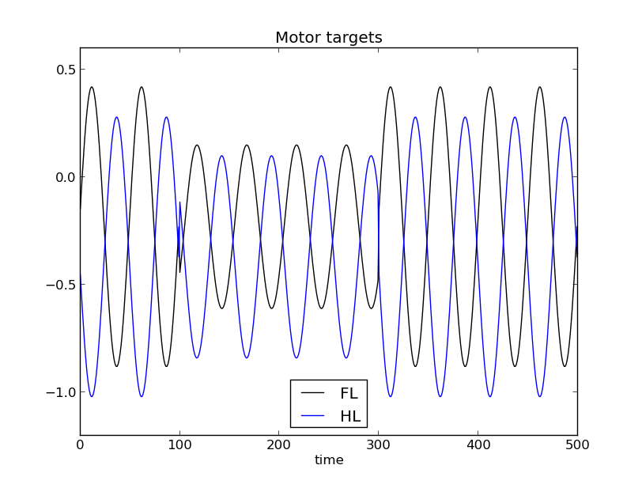

Control
=======

.. module:: PuPy

.. contents::

Introduction
------------

Given the :py:class:`supervisor <WebotsSupervisorMixin>` and
:py:class:`robot <WebotsPuppyMixin>`, a working controller can be set up.
As described on the :doc:`robot` page, this is achieved by
implementing an ``actor``, compliant with the :py:class:`RobotActor`
interface. Again, note that the interface is desined such that it may
be matched by either a class or a function.

The actor gets the sensor measurements of the last epoch (i.e. since
the previous execution of the actor) and information about the timeframe
of the next action. Its purpose is to come up with a a sequence of motor
targets that will be applied next. Read the reference of
:py:class:`WebotsPuppyMixin` carefully, so that you understand the setup
and effect of the timings.

Although the task of implementing a controller is generally problem
dependent, some typical actors have been prepared. The most common
control setup is based on :py:class:`Gaits <Gait>`. A gait is a sinewave,
expressed through its parameters (amplitude, frequency, phase and offset).
Some parametersets that induce some specific walking patterns have
already been found in various works. Yet, the gait itself does not
implement a controller but only a series of motor targets. Besides that,
the controller may also decide which gait to apply out of several
choices. Or it might be desired to switch the gait during the
experiment. Some actors have been prepared for this purpose, their
reference and explanation can be found below.

One actor that deserves special attention is :py:class:`RobotCollector`.
It is a transparent actor, meaning that it delegates the action decision
to another one but only stores the sensory data in a file (also see the
`Example`_).

Example
-------

This example is very similar to the one at :doc:`robot`; make sure, you
understand the robot aspects.

Again, it's first required to import some modules:

>>> from controller import Robot
>>> import PuPy

In this example, the robot movement is based on some predefined walking
patterns. A pattern is defined through a :py:class:`Gait`, which
generates a specific sinewave. The parameters of the wave have to be
passed to the :py:class:`Gait` constructor. Since there are four motors,
there are four values for each parameter.

>>> boundLeft = PuPy.Gait({
>>>     'frequency' : (1.0, 1.0, 1.0, 1.0),
>>>     'offset'    : ( -0.23, -0.23, -0.37,-0.37),
>>>     'amplitude' : ( 0.38, 0.65, 0.47, 0.65),
>>>     'phase'     : (0.1141, 0.0, 0.611155, 0.5)
>>> })

One pattern would be quite boring, so another one is defined:

>>> boundRight = PuPy.Gait({
>>>     'frequency' : (1.0, 1.0, 1.0, 1.0),
>>>     'offset'    : ( -0.23, -0.23, -0.37, -0.37),
>>>     'amplitude' : ( 0.65, 0.38, 0.65, 0.47),
>>>     'phase'     : (0.0, 0.1141, 0.5, 0.611155)
>>> })

The gaits only implements a sequence of motor targets, not an actor. One
might just apply one constant pattern (there's :py:class:`ConstantGaitControl`
for that) but may also come up with other gait-based controllers. Here,
the goal is to randomly switch between the two gaits. For this, the
respective controller is initialized with the two gaits:

>>> actor = PuPy.RandomGaitControl([boundLeft, boundRight])

This now is an actor, as it implements the :py:class:`RobotActor`
interface - of course, :py:class:`RandomGaitControl` is designed to do
so. Yet, it might also be interesting to store sensor readouts of the
simulation in a file for later inspection. For this purpose, there exists
the :py:class:`RobotCollector`. It is a transparent actor, meaning that
it simulates an actor towards the :py:class:`WebotsPuppyMixin` but lets
a 'true' actor do the work. It just stores the provided measurements in
a file.

This transparency can also be observed in the initialization, when the
previously defined actor is passed as argument, together with a target
file.

>>> observer = PuPy.RobotCollector(actor, expfile='/tmp/puppy_sim.hdf5')

When the actor is initialized, it is passed to the constructor of
:py:class:`WebotsPuppyMixin` through the :py:func:`robot builder <robotBuilder>`.
Then, the robot controller can be executed and its effect observed in
webots or from the data log.

>>> r = PuPy.robotBuilder(Robot, observer, sampling_period_ms=20)
>>> r.run()

Once some data has been gathered and the simulation is stopped, the
data file may be inspected. Note that the code below is not part of the
control script anymore but a seperate python instance
(e.g. in a script or interactively). Note that this piece of code
employs [matplotlib]_ for plotting.

>>> import h5py, pylab
>>> f = h5py.File('/tmp/puppy_sim.hdf5','r')
>>> pylab.plot(f['0']['trg0'][:500], 'k', label='FL')
>>> pylab.plot(f['0']['trg2'][:500], 'b', label='HL')
>>> pylab.title('Motor targets')
>>> pylab.xlabel('time')
>>> pylab.legend(loc=0)
>>> pylab.show()

In the appearing window, the target of the front and hind left motor is
displayed. It can be observed that the shape of the target curves change
between the two gaits defined. The figure below gives an example of this.

Reference
---------

.. autoclass:: RobotActor
    :members:

.. autoclass:: PuppyActor
    :show-inheritance:

.. autoclass:: Gait
    :members:

.. autoclass:: RandomGaitControl
    :members:
    :show-inheritance:

.. autoclass:: ConstantGaitControl
    :members:
    :show-inheritance:

.. autoclass:: SequentialGaitControl
    :members:
    :show-inheritance:

.. autoclass:: RobotCollector
    :members:

.. autoclass:: PuppyCollector
    :show-inheritance:

Inheritance
-----------

.. inheritance-diagram::
    RobotActor
    PuppyCollector
    PuppyActor
    
